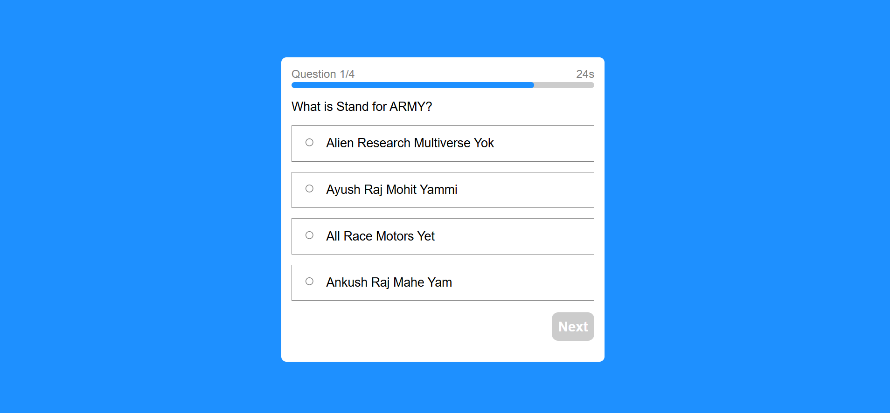

# Online Test Taking Website

This is a user-friendly website developed using HTML, CSS, and JavaScript. It allows users to take online tests with a 30-second timer included. The website presents four multiple-choice questions, each with one correct answer. Users earn one point for selecting the correct option.

## Features

- User-friendly interface
- 30-second timer for each Questions
- Four multiple-choice questions per Question
- Score tracking
- Responsive design for various devices

## Developer

This website was created by [Ankush Raj Mahe Yam (ARMY)](https://github.com/AnkushRajMaheYam). All rights reserved.

## Usage

1. Clone this repository:

2. Open the `index.html` file in your web browser to start taking tests.

## Contributing

## About Me  

Hi, I’m **Ankush Raj Mahe Yam (ARMY)**, an aspiring software developer. I’m passionate about coding and enjoy sharing my learning journey to help others grow.  

🌟 Connect with me:  
- **Google Search:** [Ankush Raj Mahe Yam](https://www.google.com/search?q=ankush+raj+mahe+yam)  
- **LinkedIn:** [Ankush Raj Mahe Yam](https://linkedin.com/in/ankushrajmaheyam)  
- **GitHub:** [Ankush Raj Mahe Yam](https://github.com/AnkushRajMaheYam)  
- **Instagram:** [@AnkushRajaMaheYam](https://instagram.com/AnkushRajaMaheYam)  
- **Facebook:** [Ankush Raj Mahe Yam](https://facebook.com/AnkushRajMaheYam)  

---

Contributions are welcome! Feel free to submit issues or pull requests.

## License

This project is licensed under the [MIT License](https://github.com/AnkushRajMaheYam/Online-Test-Exam/blob/main/LICENSE.md).
